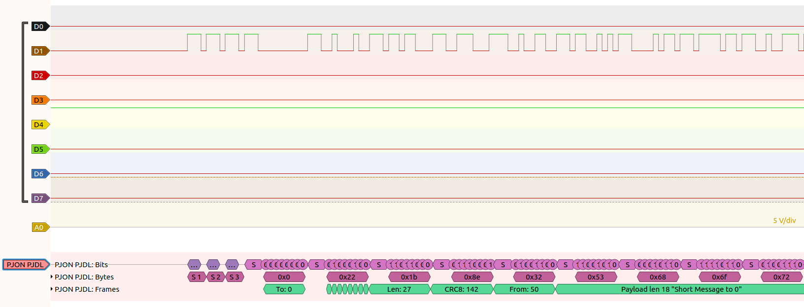

# sigrokdecode_for_pjon
Sigrok decoder and samples for PJON PDJL (Software Bit Bang). See image:

To use, put the pjon_pjdl folder into the decoders directory. On my Ubuntu machine this was '/usr/share/libsigrokdecode/decoders/'.
